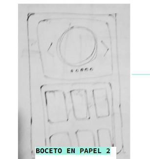
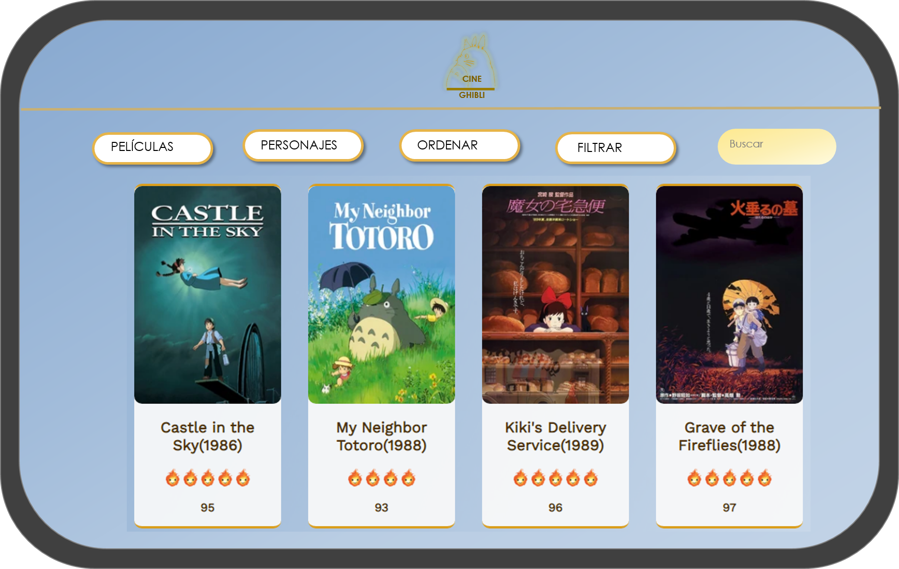

# Data Lovers

## Índice

* [1. Introducción](#1-Introducción)
* [2. Recopilando información](#2-recopilando-información)
* [3. Diseño de interfaz](#3- Diseño-de-interfaz)
* [4. Interfaz de Usuario (HTML/CSS/JS)](#4-Implementación-de-la-Interfaz-de-Usuario-(HTML/CSS/JS))
* [5.  Pruebas unitarias](#5-Pruebas-unitarias)

***

## 1. Introducción

En este proyecto construimos una pagina web , que toma por base un conjunto de datos los cuales son mostrados en la interfaz por medio de la presentacion de una tarjeta que contiene el poster de la pelicula,asi com su fecha de lanzamiento y un puntaje sobre el cual esta rankeado.
El usuario puede interactuar con los datos por medio de botones,menus desplegables y un espacio para buscar por medio de texto.Las accines que permite  la interfaz son:
              Visualización de todas las películas.
               Ordenado de las peliculas por orden de la A-Z y de la Z-A.
               Filtrado de las peliculas en base al director y productor que participaron en ellas.
               Busqueda de las peliculas por formato de texto que toma en cuenta las coincidencias con el titulo o año.
               
La data que utilizamos para este proyecto fue la siguiente:              

* [Studio Ghibli](src/data/ghibli/ghibli.json).
  En este set encontrarás una lista de las animaciones y sus personajes del
  [Studio Ghibli](https://ghiblicollection.com/).
  - [Investigación con seguidores de las animaciones del Studio Ghibli](src/data/ghibli/README.md)

## 2. Recopilando informacion

Planteamos un seguimiento de los objetivos a alcanzar y lo que esperabamos de nuestra pagina

### 2.1. Definiendo al usuario

Hicimos la pagina enfocada a usuarios que estaban familiarizados y tenian interes en los films de Studio Ghibli por lo cual no era extrictamente necesario iniciar con un contexto tan general de la informacion.

Para poder encaminar nuestro proyecto buscamos una retroalimentacion de nuestros prospectos de usuarios por medio de una encuesta [Google Forms](https://docs.google.com/forms/d/1CBeQi23bW2J1OdZLrwLgxiqm4ndU9vKbKoNhQOCPYwk/edit?usp=sharing),la cual tenia el proposito de orientarnos acerca de las preferencias de nuestros usuarios.

Los resultados que arrojó la encuesta nos mostraron usuarios bastante familiarizados con el tema de la data para quienes la importancia de la data ya seguia una jerarquia siendo su principal interes el filtrado de dichos datos por titulo,año de lanzamiento y director.

Nuestros usuarios ademas se sentian mas comodos con la idea de interactuar con la interfaz por medio de botones y menues desplegables, prefiriendo estos ultimos sobre los enlaces.

Los usuarios tenian interes en un buscador intuitivo que les ayudara a encontrar el título de una película con solo tener unas pocas coincidencias de texto.

### 2.2.HU

Con la informacion recopilada luego de aplicar un orden y priorizacion se destacaron las siguientes historias:

#### 2.2.1.

       Yo como usuario de Cine Ghibli 

       quiero poder visualizar los posters de las películas 

       para saber cuales son todas.

#### 2.2.2.
       
       Yo como usuario de Cine Ghibli 

       quiero poder buscar las películas por título, personajes y año

       para encontrar la película que estoy buscando.

  
#### 2.2.3. 

       Yo como usuario de Cine Ghibli 

       quiero poder fltrar las películas por personajes, título y año
       
       para agruparlas según mis preferencia

#### 2.2.4.

        Yo como usuario de Cine Ghibli

        quiero ver en la pantalla principal un top 5 de las mejores películas

        para acceder rápido a ellas.

## 3. Diseño de interfaz
      
       El diseño de la interfaz se hizo de acuerdo a la informacion y sugerencias de nuestros usuarios, en las cuales expresaban 
       cuestiones como la sensacion de sobresaturacion visual que experimentaban al tener fondos con multiples formas y colores
       al mismo tiempo que las tarjetas con posters sobre ello.

       Tomamos tambien en cuenta le necesidad de nuestros usuarios de poder identificar a primera vista los botones y menues
       ademas de que hacen cada uno ,teniendo como consecuencia una menor curva de aprendizaje necesaria en el usuario
       a la hora de manejar la interfaz.

       Nuestra interfaz parte dede ser visualmente sencilla y armoniosa al mismo tiempo busca redirigir y 
       enfocar al usuario hacia el contenido principal asi como hacia el area de interaccion.

### 3.1. Prototipo de baja fidelidad

Al momento de contrastar ideas para crear nuestra interfaz,ambas hicimos algunos bocetos en papel y en herramientas como power point y paint para expresar como visualizabamos nuestra pagina y encontrar puntos de acuerdo.

### 3.2. Prototipo de alta fidelidad
Se realizo tambien un prototipo ejemplificando el flujo que queriamos tuviera nuestra pagina:

         
     

#### 4. Interfaz de Usuario (HTML/CSS/JS)

    Buscando que la interacción con el DOM fuera sencilla y eficiente descidimos
     precindir de usar selectores por Id y nos enfocamos en selectore de clase 
     que aunque son menosespecificos permiten maneja el conjunto de datos 
     de acuerdo a  un mismo estilo en CSS sin tener conflictos de especificidad.

    Tambien consideramos dividir la ejecucion de nuestras funciones JS
     en tres archivos:
    
    main.js: Encargado de las interacciones con el DOM.

    generator.js: Encargado de generar HTML a partir de iterar la data y
     convertirlo a HTML

#### 5. Pruebas unitarias

Con respecto a las pruebas unitarias se realizaron 15 para cubrir 4 funciones:

Ordenado(sortData):La funcion constituye en una serie de condicionales vinculados a un evento "change" desde los valores de 2 opciones
en un input de tipo select:
        
           De la A-Z

           De la Z-A

 En el ultimo caso hubo una linea que no fue cubierta por el test.

 Buscador(filterFilms):Esta funcion se hizo en base a un evento "keyup" dentro de un input de tipo texto,que a su vez se vinculaba con
 una funcion que comparaba el valor con coincidencias dentro de nuestra data en:

            Titulo 

            Fecha de lanzamiento 

Filtro(filterDirector):Esta funcion tambien esta vinculada a un evento "change" en un input select,pero compara el valor de la opcion con
coincidencias dentro nuestra data en:

            Director

            Productor

Puntaje(comparador):Esta funcion se encarga de compara el valor de la key "rt_score" y asignarle un nuevo valor de acuerdo al rangos en el que se encontraba,recibiendo asi un puntaje de 1 a 5.

Por ultimo se comprobo que todas las anteriores fueran una funciones.

